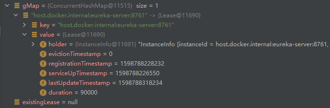

# Spring Cloud Eureka


## 入口

org.springframework.boot.autoconfigure.EnableAutoConfiguration=\
  org.springframework.cloud.netflix.eureka.server.EurekaServerAutoConfiguration

@EnableEurekaServer

(org.springframework.cloud.netflix.eureka.server.EnableEurekaServer)

-> org.springframework.cloud.netflix.eureka.server.EurekaServerMarkerConfiguration

-> org.springframework.cloud.netflix.eureka.server.EurekaServerAutoConfiguration


## Jersey MVC

jerseyMVC

注册过滤器

org.springframework.cloud.netflix.eureka.server.EurekaServerAutoConfiguration.jerseyFilterRegistration


org.springframework.cloud.netflix.eureka.server.EurekaServerAutoConfiguration.jerseyApplication

javax.ws.rs.ext.Provider => 等同于 @RestController
javax.ws.rs.Path         => 等同于 @RequestMapping

## 注册中心功能

- 心跳连接
- 服务剔除
- 服务下架
- 服务注册
- 集群通讯
- 自我保护机制

## Eureka 核心处理类

com.netflix.eureka.resources.ApplicationResource

com.netflix.eureka.resources.InstanceResource

## 服务注册：

-> com.netflix.eureka.resources.ApplicationResource.addInstance

-> org.springframework.cloud.netflix.eureka.server.InstanceRegistry.register(com.netflix.appinfo.InstanceInfo, boolean)

> register 方法并没有真正去注册，而是交给父类的方法
> 这个设计模式很关键

-> org.springframework.cloud.netflix.eureka.server.InstanceRegistry.handleRegistration

> 它只是发布了事件，事件驱动器
> 

```java
		log("register " + info.getAppName() + ", vip " + info.getVIPAddress()
				+ ", leaseDuration " + leaseDuration + ", isReplication "
				+ isReplication);
		publishEvent(new EurekaInstanceRegisteredEvent(this, info, leaseDuration,
				isReplication));
```

-> com.netflix.eureka.registry.PeerAwareInstanceRegistryImpl.register

> 这个依然没有进行服务注册
> 它只是拿到微服务的过期时间
> com.netflix.eureka.lease.Lease.DEFAULT_DURATION_IN_SECS
> 默认 90s
> 30s 发一次请求

-> com.netflix.eureka.registry.AbstractInstanceRegistry.register


> 这个方法才在真正进行服务注册


-> com.netflix.eureka.registry.PeerAwareInstanceRegistryImpl.replicateToPeers

> 集群信息同步
> 责任链模式


## 服务注册数据结构

ConcurrentHashMap<String, Map<String, Lease<InstanceInfo>>>

服务ID    -> 服务节点ID - 服务
         -> 服务节点ID - 服务
         -> 服务节点ID - 服务
         -> 服务节点ID - 服务
        
com.netflix.eureka.lease.Lease

心跳续约对象

> 包含：注册信息、最后操作时间、注册时间、过期时间、剔除时间

服务注册表 gMap


        
## 注册信息冲突解决方案

当发生注册信息发生冲突时，Eureka 会根据最后活跃时间来判断到底覆盖哪一个


 ## 续约
 
 
 com.netflix.eureka.registry.AbstractInstanceRegistry.renew
 
 -> com.netflix.eureka.lease.Lease.renew
 
 > 修改最后操作时间


## 服务剔除

启动一个定时任务

com.netflix.eureka.registry.AbstractInstanceRegistry.evict(long)

判断，是否开启服务保护机制

```java
        if (!isLeaseExpirationEnabled()) {
            logger.debug("DS: lease expiration is currently disabled.");
            return;
        }
```

com.netflix.eureka.registry.PeerAwareInstanceRegistryImpl.isLeaseExpirationEnabled

> 判断有没有打开自我保护机制

当 eureka 短时间内，大量剔除微服务的话，他就会考虑打开自我保护机制

默认是 15 分钟，剔除85% 的节点全部宕机，就打开

com.netflix.eureka.EurekaServerConfig.getRenewalPercentThreshold

```java
        // To compensate for GC pauses or drifting local time, we need to use current registry size as a base for
        // triggering self-preservation. Without that we would wipe out full registry.
        int registrySize = (int) getLocalRegistrySize();
        int registrySizeThreshold = (int) (registrySize * serverConfig.getRenewalPercentThreshold());
        int evictionLimit = registrySize - registrySizeThreshold;

        int toEvict = Math.min(expiredLeases.size(), evictionLimit);
```


com.netflix.eureka.lease.Lease.isExpired(long)

判断服务是否过期

服务剔除算法：随机

```java
            Random random = new Random(System.currentTimeMillis());
            for (int i = 0; i < toEvict; i++) {
                // Pick a random item (Knuth shuffle algorithm)
                int next = i + random.nextInt(expiredLeases.size() - i);
                Collections.swap(expiredLeases, i, next);
                Lease<InstanceInfo> lease = expiredLeases.get(i);

                String appName = lease.getHolder().getAppName();
                String id = lease.getHolder().getId();
                EXPIRED.increment();
                logger.warn("DS: Registry: expired lease for {}/{}", appName, id);
                internalCancel(appName, id, false);
            }
```

服务剔除：

com.netflix.eureka.registry.AbstractInstanceRegistry.internalCancel

清缓存

com.netflix.eureka.registry.ResponseCacheImpl.invalidate(java.lang.String, java.lang.String, java.lang.String)

## HTTP通讯

com.netflix.discovery.shared.transport.EurekaHttpClient


## 集群同步

```java 
            // If it is a replication already, do not replicate again as this will create a poison replication
            if (peerEurekaNodes == Collections.EMPTY_LIST || isReplication) {
                return;
            }
```

isReplication 如果是注册，是 false，如果是同步，就是false

如果是同步，就不会再同步，造成死循环

